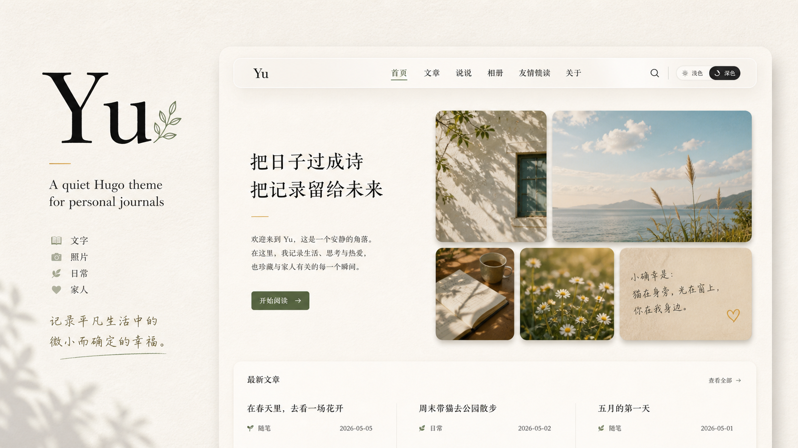

# Yu



Yu is a quiet Hugo theme for personal journals, family notes, photo stories, and long-form writing. It focuses on a narrow reading column, warm paper-like background, cover cards, Chinese typography, article table of contents, lightweight search, and Medium-style image zoom.

## Documentation

- [中文文档](#中文文档)
- [English Documentation](#english-documentation)
- [Waline + Vercel + Neon 评论教程 / Comment Guide](docs/waline-vercel-neon.md)

---

## 中文文档

## 中文目录

- [功能特性](#功能特性)
- [新手从零部署](#新手从零部署)
- [常用内容](#常用内容)
- [图片优化和原图](#图片优化和原图)
- [首页首屏配置](#首页首屏配置)
- [评论系统](#评论系统)
- [SEO 和分享](#seo-和分享)
- [内容结构示例](#内容结构示例)
- [预览 exampleSite](#预览-examplesite)
- [Waline + Vercel + Neon 评论教程](docs/waline-vercel-neon.md#中文教程)

## 功能特性

- 毛玻璃吸顶导航
- 首页文章卡片，支持封面渐变遮罩
- 未设置封面时，自动使用正文第一张 Markdown 图片
- 适合中文阅读的 LXGW WenKai 字体
- 文章阅读时间和宽屏目录
- 跟随系统的深色模式，并支持手动切换
- 说说页面，适合短记录和碎片想法
- 友情链接页面，数据来自 `data/links.yaml`
- 公开相册，基于 Hugo page bundle
- 文章和相册图片自动生成 WebP 展示图，点击放大时保留原图
- 代码块复制按钮
- 本地 JSON 搜索
- SEO、Open Graph、Twitter Card、JSON-LD
- 可插拔评论系统：Cusdis、Giscus、Waline、Twikoo
- 标签和 taxonomy 页面

## 新手从零部署

下面是一条尽量完整的新手路线：从安装 Hugo，到本地预览，再到 Cloudflare Pages 自动部署。

### 1. 安装 Hugo

macOS 可以用 Homebrew：

```bash
brew install hugo
```

检查是否安装成功：

```bash
hugo version
```

建议使用 Hugo Extended 版本，最低版本要求见 `theme.toml`。

### 2. 创建一个新站点

```bash
hugo new site myblog
cd myblog
git init
```

### 3. 安装主题

```bash
git submodule add https://github.com/Lau0x/hugo-theme-yu.git themes/yu
```

在 `hugo.toml` 中启用主题：

```toml
theme = 'yu'
```

### 4. 写基础配置

把 `hugo.toml` 改成类似这样：

```toml
baseURL = 'https://example.org/'
locale = 'zh-CN'
title = 'Example Blog'
theme = 'yu'
summaryLength = 36

[params]
lang = 'zh-CN'
description = 'A Hugo example site'
author = 'Example Author'
footer = '© 2026 Example Author'
mainSections = ['posts']
projectsURL = '/projects/'
homeBrand = 'Yu'
homeTagline = 'A quiet Hugo theme for personal journals'
homeKicker = 'Welcome to Yu'
homeTitle = '日子很长，慢慢记。'
homeDescription = '这里适合记录生活、想法、照片和那些值得慢慢保存的瞬间。'
homeNote = '把今天写下来，留给明天慢慢看。'

[outputs]
home = ['HTML', 'RSS', 'JSON']

[taxonomies]
tag = 'tags'
category = 'categories'
```

### 5. 创建搜索页

```bash
hugo new search.md
```

把 `content/search.md` 改成：

```toml
+++
title = '搜索'
layout = 'search'
+++
```

### 6. 创建第一篇文章

```bash
hugo new posts/hello-world.md
```

打开 `content/posts/hello-world.md`，把 `draft` 改为 `false`，然后写正文：

```yaml
---
title: Hello World
date: 2026-05-08T10:00:00+08:00
draft: false
description: My first post.
tags:
  - note
cover:
---

Hello, Hugo.
```

### 7. 本地预览

```bash
hugo server -D
```

然后打开：

```text
http://localhost:1313/
```

### 8. 提交到 GitHub

```bash
git add -A
git commit -m "Initial site"
git branch -M main
git remote add origin git@github.com:your-name/your-blog.git
git push -u origin main
```

### 9. 用 Cloudflare Pages 部署

在 Cloudflare Pages 新建项目，连接你的 GitHub 仓库，构建设置如下：

```text
Build command: hugo
Build output directory: public
Root directory: /
```

不要提交 `public/`。建议 `.gitignore` 加上：

```gitignore
.DS_Store
.hugo_build.lock
public/
resources/
```

之后你每次写完文章，只需要提交并推送源码，Cloudflare Pages 会自动构建。

## 常用内容

### 文章封面

文章 front matter 支持 `cover`、`image` 或 `images`：

```yaml
---
title: Hello World
date: 2026-05-08T10:00:00+08:00
draft: false
description: A short summary for search engines and social previews.
cover: /uploads/cover.jpg
tags:
  - note
---
```

如果没有设置封面，首页卡片和分享卡片会自动使用正文第一张 Markdown 图片。

## 图片优化和原图

Yu 会自动优化放在 page bundle 里的本地图片：

```text
content/posts/my-post/
  index.md
  photo.jpg

content/albums/spring-walk/
  index.md
  01.jpg
  02.jpg
```

在文章里这样引用：

```markdown

```

主题会在构建时生成多尺寸 WebP 展示图，浏览器会按屏幕大小选择合适版本；点击图片放大时，会优先打开原图。这样页面加载更快，同时原始 JPG、PNG 或 WebP 仍然保留，适合以后想保存原图或展示 HDR 原片的场景。

外链图片、`/static` 里的绝对路径图片和 SVG 会保持原样，不会被主题转换。

## 首页首屏配置

首页会自动聚合文章、说说和公开相册。你也可以在 `hugo.toml` 的 `[params]` 里调整首屏文案：

```toml
[params]
homeBrand = 'Yu'
homeTagline = 'A quiet Hugo theme for personal journals'
homeKicker = 'Welcome to Yu'
homeTitle = '日子很长，慢慢记。'
homeDescription = '这里适合记录生活、想法、照片和那些值得慢慢保存的瞬间。'
homeNote = '把今天写下来，留给明天慢慢看。'
homePhotoNote = '照片会慢慢长成时间的索引。'
homeDailyNote = '一些不必写成长文的片刻，也值得被保存。'
homeQuoteLabel = '片刻'
homeQuote = '光落在窗上，日子慢慢发亮。'
```

首屏大图会优先从文章 `cover`、`image`、`images` 或正文第一张 Markdown 图片中自动获取。相册拼贴会读取公开相册里的图片；如果还没有相册图片，会显示简短纸条占位。

### 说说

创建说说索引页：

```bash
mkdir -p content/moments
```

创建 `content/moments/_index.md`：

```yaml
---
title: 说说
---

一些不需要展开成文章的零碎记录。
```

创建一条说说：

```bash
hugo new moments/2026-05-08-note.md
```

示例：

```yaml
---
title: "2026-05-08 09:00"
date: 2026-05-08T09:00:00+08:00
draft: false
mood: 随手记
---

今天随手记一笔。
```

### 友情链接

创建 `content/links/_index.md`：

```yaml
---
title: 友情链接
---

一些值得常去看看的地方。
```

然后创建 `data/links.yaml`：

```yaml
- name: Hugo
  url: https://gohugo.io/
  description: 快速、灵活的静态网站生成器。
```

### 相册

创建相册索引页：

```bash
mkdir -p content/albums
```

创建 `content/albums/_index.md`：

```yaml
---
title: 相册
---

一些日常照片和路上的片段。
```

每个相册是一个 page bundle：

```text
content/albums/spring-walk/
  index.md
  01.jpg
  02.jpg
```

`index.md` 示例：

```yaml
---
title: 春日散步
date: 2026-05-08T10:00:00+08:00
draft: false
description: 几张日常照片。
location: 示例城市
private: false
---

这里是相册说明。
```

`private: true` 的相册不会出现在公开相册列表里。注意：这只是主题层面的隐藏，不是安全加密；不要把真正敏感的照片公开部署。

### 关于页

创建：

```bash
hugo new about.md
```

示例：

```yaml
---
title: 关于
url: /about/
---

这里写你的介绍。
```

### 独立 HTML 页面

如果你想写一个完全不依赖主题的静态页面，可以放在 `static/`：

```text
static/projects/index.html
```

访问地址就是：

```text
/projects/
```

如果想在导航中显示项目页：

```toml
[params]
projectsURL = '/projects/'
```

### 自定义 URL

只改最后一段路径：

```yaml
---
title: Hello World
slug: hello-world
---
```

完全指定路径：

```yaml
---
title: Project Hub
url: /projects/maker-tools/
---
```

旧链接跳转：

```yaml
---
title: New Page
aliases:
  - /old/path/
---
```

## 评论系统

默认不启用评论。配置 `params.comments.provider` 后才会显示评论区。

完整部署教程见：[Waline + Vercel + Neon 评论教程](docs/waline-vercel-neon.md#中文教程)。

### Cusdis

```toml
[params.comments]
provider = 'cusdis'

[params.comments.cusdis]
appId = 'your-cusdis-app-id'
host = 'https://cusdis.com'
lang = 'zh-cn'
```

### Giscus

```toml
[params.comments]
provider = 'giscus'

[params.comments.giscus]
repo = 'owner/repo'
repoId = 'your-repo-id'
category = 'General'
categoryId = 'your-category-id'
mapping = 'pathname'
reactionsEnabled = '1'
inputPosition = 'bottom'
theme = 'preferred_color_scheme'
lang = 'zh-CN'
```

Giscus 使用 GitHub Discussions，访客需要 GitHub 账号。

### Waline

```toml
[params.comments]
provider = 'waline'

[params.comments.waline]
serverURL = 'https://your-waline-server.example.com'
lang = 'zh-CN'
```

Waline 需要后端服务和数据库，但数据更可控。推荐给 Waline 服务绑定一个独立子域名，例如 `https://comments.example.com`，以后迁移评论服务时只需要调整域名指向。

### Twikoo

```toml
[params.comments]
provider = 'twikoo'

[params.comments.twikoo]
envId = 'https://your-twikoo-server.example.com'
lang = 'zh-CN'
```

Twikoo 也需要后端服务，可以自托管。

## SEO 和分享

主题会自动生成：

- `<title>` 和 meta description
- canonical URL
- Open Graph metadata
- Twitter Card metadata
- 文章发布时间和更新时间
- 文章标签
- JSON-LD 结构化数据

建议每篇文章设置 `description` 和 `cover`。如果不设置，主题会使用页面摘要和正文第一张 Markdown 图片兜底。

## 内容结构示例

```text
content/
  posts/
    hello-world.md
  moments/
    _index.md
    2026-05-08-note.md
  albums/
    _index.md
    spring-walk/
      index.md
      01.jpg
      02.jpg
  links/
    _index.md
  about.md
  search.md
data/
  links.yaml
static/
  projects/
    index.html
```

## 预览 exampleSite

在包含 `hugo-theme-yu` 的上级目录运行：

```bash
hugo server --source hugo-theme-yu/exampleSite --themesDir . --theme hugo-theme-yu -D
```

---

## English Documentation

## English Contents

- [Features](#features)
- [Quick Start](#quick-start)
- [Cloudflare Pages](#cloudflare-pages)
- [Posts](#posts)
- [Image Optimization And Originals](#image-optimization-and-originals)
- [Home Hero](#home-hero)
- [Moments](#moments)
- [Friends Links](#friends-links)
- [Albums](#albums)
- [Comments](#comments)
- [Custom URLs And Static Pages](#custom-urls-and-static-pages)
- [Preview Example Site](#preview-example-site)
- [Waline + Vercel + Neon Comment Guide](docs/waline-vercel-neon.md#english-guide)

## Features

- Sticky translucent header
- Post cards with cover image gradient overlay
- Automatic home card cover from the first Markdown image
- Chinese-friendly typography with LXGW WenKai
- Article reading time and wide-screen table of contents
- System dark mode with a manual toggle
- Moments section for short micro-posts
- Friends link page powered by `data/links.yaml`
- Public album section using Hugo page bundles
- Automatic WebP display images for local post and album photos, with original files preserved for zoom view
- Code block copy button
- JSON-powered local search
- SEO metadata, Open Graph cards, Twitter cards, and JSON-LD
- Pluggable comments: Cusdis, Giscus, Waline, or Twikoo
- Tags and taxonomy pages

## Quick Start

Install Hugo, create a site, and add the theme:

```bash
hugo new site myblog
cd myblog
git init
git submodule add https://github.com/Lau0x/hugo-theme-yu.git themes/yu
```

Set the theme in `hugo.toml`:

```toml
theme = 'yu'
```

Basic config:

```toml
baseURL = 'https://example.org/'
locale = 'zh-CN'
title = 'Example Blog'
theme = 'yu'
summaryLength = 36

[params]
lang = 'zh-CN'
description = 'A Hugo example site'
author = 'Example Author'
footer = '© 2026 Example Author'
mainSections = ['posts']
projectsURL = '/projects/'
homeBrand = 'Yu'
homeTagline = 'A quiet Hugo theme for personal journals'
homeKicker = 'Welcome to Yu'
homeTitle = '日子很长，慢慢记。'
homeDescription = '这里适合记录生活、想法、照片和那些值得慢慢保存的瞬间。'

[outputs]
home = ['HTML', 'RSS', 'JSON']
```

Create the search page:

```toml
+++
title = 'Search'
layout = 'search'
+++
```

Preview locally:

```bash
hugo server -D
```

## Cloudflare Pages

Use these build settings:

```text
Build command: hugo
Build output directory: public
Root directory: /
```

Do not commit `public/`. Let Cloudflare Pages build it from source.

## Posts

Use `cover`, `image`, or `images` in front matter:

```yaml
---
title: Hello World
date: 2026-05-08T10:00:00+08:00
draft: false
description: A short summary for search engines and social previews.
cover: /uploads/cover.jpg
tags:
  - note
---
```

If no cover is set, the home card and sharing metadata will use the first Markdown image in the post body.

## Image Optimization And Originals

Yu automatically optimizes local images stored in Hugo page bundles:

```text
content/posts/my-post/
  index.md
  photo.jpg

content/albums/spring-walk/
  index.md
  01.jpg
  02.jpg
```

Reference a local post image like this:

```markdown

```

During the Hugo build, Yu creates responsive WebP display images. Browsers pick an appropriate size for the current screen, while click-to-zoom uses the original file whenever possible. This keeps pages lighter without discarding your original JPG, PNG, or WebP files.

Remote images, absolute `/static` paths, and SVG files are left unchanged.

## Home Hero

The home page automatically gathers posts, moments, and public albums. You can customize the hero copy in `hugo.toml`:

```toml
[params]
homeBrand = 'Yu'
homeTagline = 'A quiet Hugo theme for personal journals'
homeKicker = 'Welcome to Yu'
homeTitle = '把日子过成诗，把记录留给未来'
homeDescription = '这里适合记录生活、想法、照片和那些值得慢慢保存的瞬间。'
homeNote = '把今天写下来，留给明天慢慢看。'
homePhotoNote = '照片会慢慢长成时间的索引。'
homeDailyNote = '一些不必写成长文的片刻，也值得被保存。'
homeQuoteLabel = '片刻'
homeQuote = '光落在窗上，日子慢慢发亮。'
```

The large hero image is picked from post `cover`, `image`, `images`, or the first Markdown image in the post body. Album collage images come from public album page bundles. If there are no album images yet, Yu shows short paper-note placeholders.

## Moments

Create `content/moments/_index.md`:

```yaml
---
title: Moments
---
```

Then create short notes under `content/moments`.

## Friends Links

Create `content/links/_index.md`, then add links in `data/links.yaml`:

```yaml
- name: Hugo
  url: https://gohugo.io/
  description: A fast and flexible static site generator.
```

## Albums

Each album should be a page bundle:

```text
content/albums/spring-walk/
  index.md
  01.jpg
  02.jpg
```

Albums with `private: true` are hidden from the public album list. This is not access control; do not deploy sensitive photos publicly unless your hosting layer protects them.

## Comments

Comments are disabled by default. Set `params.comments.provider` to enable one comment system.

Full setup guide: [Waline + Vercel + Neon Comment Guide](docs/waline-vercel-neon.md#english-guide).

Supported providers:

- `cusdis`
- `giscus`
- `waline`
- `twikoo`

Waline example:

```toml
[params.comments]
provider = 'waline'

[params.comments.waline]
serverURL = 'https://your-waline-server.example.com'
lang = 'zh-CN'
```

Using a dedicated subdomain such as `https://comments.example.com` is recommended. It makes future comment-service migration easier because the blog can keep the same `serverURL`.

## Custom URLs And Static Pages

Use `slug`, `url`, and `aliases` in front matter to customize URLs.

For a completely standalone HTML page, put it under `static`, for example `static/projects/index.html`. It will be available at `/projects/`.

## Preview Example Site

From the parent directory that contains `hugo-theme-yu`:

```bash
hugo server --source hugo-theme-yu/exampleSite --themesDir . --theme hugo-theme-yu -D
```
